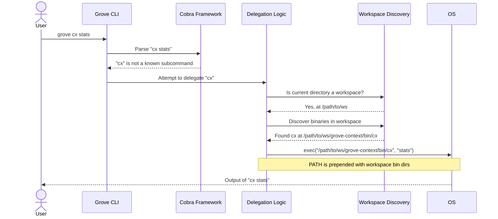

# Grove Architecture

This document describes the high-level architecture of the Grove ecosystem and the internal design of the `grove` meta-tool.

## System Overview

Grove employs a distributed architecture where each tool is an independent repository with its own release cycle. The `grove` meta-tool (`grove-meta` repository) functions as the central package manager and command orchestrator for the entire ecosystem. This design promotes modularity, independent development, and focused tooling.

The system's operation centers around two main contexts: the global installation managed within the `~/.grove` directory and the project-specific context within a Grove workspace.

```mermaid
graph TD
    subgraph User Interaction
        A[User Command: `grove <subcommand>` or `<tool> <args>`]
    end

    A --> B{Grove Meta-CLI};

    subgraph Grove Meta-CLI
        B --> B1[Command Dispatch];
        B --> B2[Tool Registry];
        B --> B3[SDK & Version Manager];
        B --> B4[Dev Link Manager];
        B --> B5[Workspace Controller];
    end

    B1 --> C{Execution Flow};

    subgraph Execution Flow
        C -- No Workspace --> D{Global Binary Resolution};
        C -- In Workspace --> E{Workspace Binary Resolution};
    end

    subgraph Workspace Context ".grove-workspace"
        E -- Uses --> E1[Workspace Binaries e.g., ./repo/bin/cx];
        E1 --> F[Individual Tool];
    end

    subgraph Global Context "~/.grove"
        D --> D1["~/.grove/bin (Symlinks)"];
        D1 -- Dev Override --> D2["devlinks.json"];
        D1 -- Release Version --> D3["active_versions.json"];
        D2 --> F;
        D3 --> D4["~/.grove/versions/..."];
        D4 --> F;
    end

    subgraph Tool Ecosystem
        F;
        G[grove-context];
        H[grove-flow];
        I[grove-notebook];
        J[...]
    end

    F --- G & H & I & J;
```

## Core Principles and Design Decisions

The architecture is guided by several key principles:

1.  **Modularity and Independence**: Each tool is a self-contained project. This allows for independent versioning, testing, and release cycles, preventing a single tool's development from blocking others.
2.  **Convention over Configuration**: Grove relies on conventions for project structure (e.g., `grove.yml`, `Makefile` targets) to automate discovery and orchestration, minimizing the need for explicit configuration.
3.  **Developer Experience First**: Features like workspace-aware binary resolution, development links (`grove dev`), and aggregated commands (`grove ws status`) are designed to streamline the development workflow within the ecosystem.
4.  **Polyglot Support**: The architecture is not limited to Go. Through a system of project handlers, it can manage and orchestrate releases for projects written in different languages (e.g., Python/Rust via Maturin).
5.  **File-based State**: Configuration and state (active versions, dev links, release plans) are stored in human-readable JSON files, making the system transparent and easy to debug or manually edit if necessary.

## Component Architecture

The `grove` meta-tool is a Go application built with the `cobra` CLI framework. Its logic is organized into distinct packages, each with a clear responsibility.

#### `cmd/` - Command Layer

This package defines the entire CLI structure, including commands, subcommands, flags, and arguments. It acts as the primary interface to the user.

-   `root.go`: Implements the main `grove` command and the core command delegation logic. It determines whether a command is internal to `grove` or should be passed to an installed tool.
-   `install_cmd.go`, `update_cmd.go`, `self_update.go`: Manage the installation and updating of tools from release artifacts.
-   `dev_*.go`: A suite of commands (`dev link`, `dev use`, `dev list`) for managing local development binaries, allowing developers to override released tool versions with locally-built ones.
-   `release.go`, `release_tui.go`: Orchestrate complex, multi-repository releases. This includes dependency-aware version calculation, changelog generation, and an interactive TUI for release planning and execution.
-   `workspace_*.go`: Provide aggregated views and operations across all repositories in an ecosystem (e.g., `ws status`, `ws issues`).
-   `deps.go`: Manages Go module dependencies across all Go-based projects in the ecosystem.

#### `pkg/` - Core Logic and Services

This directory contains the internal APIs that power the CLI commands.

-   **`pkg/sdk`**: The SDK manager handles the lifecycle of released tools. It fetches release information from GitHub, downloads binaries, organizes them by version in `~/.grove/versions`, and manages the active version for each tool in `active_versions.json`.
-   **`pkg/workspace`**: Implements the logic for discovering and interacting with Grove workspaces. It finds the ecosystem root by looking for a `grove.yml` file and discovers individual projects based on glob patterns defined therein. It also handles the discovery of local binaries within a development workspace.
-   **`pkg/devlinks`**: Manages the local development binary "override" system. It maintains a registry (`~/.grove/devlinks.json`) of binaries from local worktrees that can be activated to temporarily replace the globally installed versions.
-   **`pkg/reconciler`**: This component is responsible for the version resolution logic. It reconciles the state from `devlinks.json` and `active_versions.json` to determine the single, effective binary that should be active for a given tool and manages the symlinks in `~/.grove/bin`.
-   **`pkg/depsgraph`**: Builds an in-memory dependency graph of all projects within an ecosystem. It parses project files (like `go.mod` or `pyproject.toml`) to understand inter-project dependencies. The graph is used by the release command to determine the correct build order via topological sorting.
-   **`pkg/project`**: Provides a generic interface (`ProjectHandler`) for interacting with projects of different types (Go, Python/Maturin, etc.). This abstraction allows commands like `release` to operate on a polyglot monorepo.
-   **`pkg/release`**: Contains the complex orchestration logic for the `grove release` command. It manages the release lifecycle, from version calculation and changelog generation to Git tagging and CI monitoring. It also manages the state of an interactive release via `release_plan.json`.
-   **`pkg/gh`**: A wrapper around the GitHub CLI (`gh`) for interacting with the GitHub API, used for fetching release data, monitoring CI status, and managing repository secrets.

## Binary Management and Execution

Grove's binary management is a key feature, providing a flexible, multi-layered system that seamlessly switches between development and release versions.

### The `~/.grove` Directory

All globally managed tools and configuration reside in `~/.grove`:

```
~/.grove/
├── bin/                       # Symlinks to active tool binaries. This dir is added to PATH.
│   ├── grove                  # The meta-tool itself (usually a symlink to a version).
│   ├── cx                     # An alias symlink to the 'context' binary.
│   └── context                # The primary symlink for the 'grove-context' tool.
│
├── versions/                  # All installed release binaries, organized by version.
│   ├── v0.1.0/
│   │   └── bin/
│   │       ├── cx
│   │       └── flow
│   └── v0.2.0/
│       └── bin/
│           └── cx
│
├── active_versions.json       # Maps each tool to its active release version.
└── devlinks.json              # Registry for local development binary overrides.
```

### Version Resolution Flow

When a command is executed, Grove determines which binary to use with the following priority:

```mermaid
graph TD
    A[Command executed: `cx stats`] --> B{Inside a .grove-workspace?};
    B -- Yes --> C{Discover workspace binaries via `grove.yml`};
    C --> D{Binary `cx` found in workspace?};
    D -- Yes --> E[Execute local binary e.g., `/path/to/worktree/grove-context/bin/cx`];
    D -- No --> F{Check for dev link override in `~/.grove/devlinks.json`};
    B -- No --> F;
    F -- Yes --> G[Execute binary from dev link path e.g., `/path/to/dev/worktree/bin/cx`];
    F -- No --> H{Check for active release version in `~/.grove/active_versions.json`};
    H -- Yes --> I{Get version (e.g., v0.2.0)};
    I --> J[Execute binary from versioned path e.g., `~/.grove/versions/v0.2.0/bin/cx`];
    H -- No --> K[Error: Tool not installed];

    E --> Z[End];
    G --> Z[End];
    J --> Z[End];
    K --> Z[End];
```

This layered approach provides a seamless developer experience:
1.  **Workspace Priority**: When inside a development workspace (e.g., a git worktree), Grove automatically uses the binaries compiled within that workspace. This requires no manual commands (`grove dev use` is no longer necessary for this common case).
2.  **Global Dev Overrides**: The `grove dev` commands allow a developer to globally "pin" a tool to a specific local development version, which is useful when working on a tool that affects others outside of its immediate workspace.
3.  **Stable Releases**: The default behavior is to use the managed, stable release versions installed via `grove install`.

## Command Delegation Architecture

The `grove` CLI acts as a meta-tool. It has its own set of commands but also delegates commands to the individual tools it manages.

### Delegation Flow

The delegation logic in `cmd/root.go` follows a clear chain of responsibility:



If the command is not run from within a workspace, the flow proceeds to check the global `~/.grove/bin` directory, which contains the symlinks managed by the reconciler.

## Release Orchestration

The `grove release` command is one of the most complex features, orchestrating releases across multiple independent repositories.

1.  **Plan Generation (`release tui` or `release --interactive`)**:
    *   A `depsgraph` is built by parsing all project files (`go.mod`, `pyproject.toml`, etc.) via the `project` handlers.
    *   The graph is topologically sorted to determine the release order.
    *   The next semantic version is calculated for each repository with changes since its last tag.
    *   For each repository, an LLM (via `grove-gemini`) is used to analyze git history and generate a draft changelog and a suggested version bump.
    *   This entire plan is presented in an interactive TUI, where the developer can review, edit changelogs, adjust versions, and approve each repository for release. The state is saved to `~/.grove/release_plan.json`.

2.  **Plan Application (`A` key in TUI or `grove release apply`)**:
    *   The command iterates through the release levels determined by the topological sort. Repositories within the same level can be released in parallel.
    *   For each repository:
        a.  Dependencies on other Grove projects are updated to their newly released versions.
        b.  The `CHANGELOG.md` file is committed.
        c.  A new version tag is created and pushed.
        d.  The command monitors the GitHub Actions CI/CD workflow for a successful build and release of artifacts.
        e.  It then polls the Go module proxy to wait for the new version to become available.
    *   After all repositories in a level are successfully released and available, the process moves to the next level.
    *   Finally, the root ecosystem repository is updated to point to the new submodule commits, and a parent tag is created for the entire ecosystem release.

This dependency-aware, CI-integrated process ensures that downstream projects are only updated and released after their upstream dependencies are successfully built, released, and published.